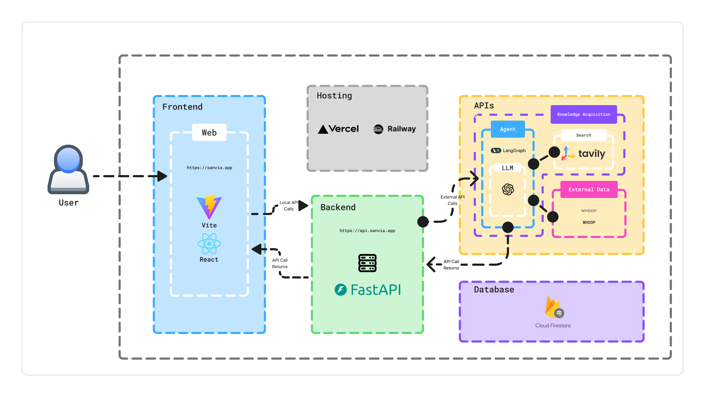
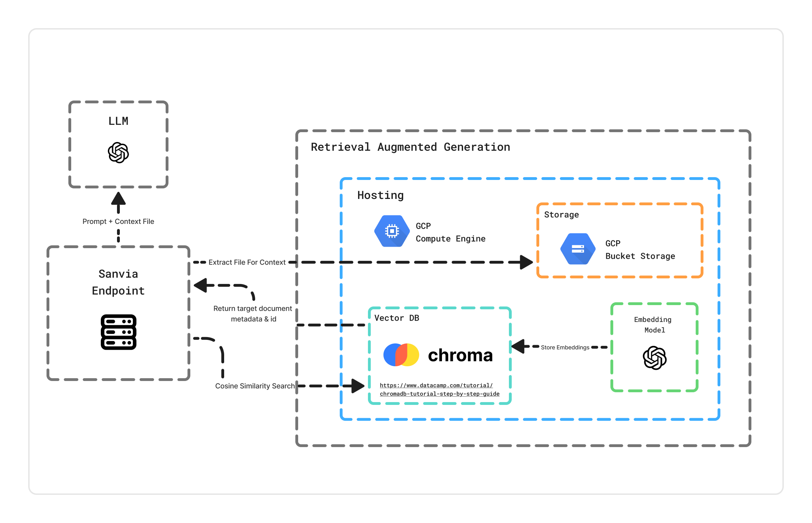

# Sanvia

<div style="text-align: center;">
  <br><br>

  
  
  
  <!--  -->
  
  
</div>

Sanvia is a privacy-first, health app that provides personalized insights by analyzing your medical documents and health data — securely and on your terms.

[Visit Sanvia](https://sanvia.app)

---

## Key Features
- **Conversational Chat** - Multi-turn chat interface for asking health-related questions and receiving personalized answers.
- **Document Upload** – Upload lab results and medical reports to get personalized, context-aware responses using RAG.
- **Health Tracking Integration** – Sync with platforms like WHOOP to incorporate real-time health metrics into responses.
- **Privacy-First Architecture** – End-to-end encryption (*upcoming*), de-identification, and full user control over personal health data.

---

## Tech Stack
- **Frontend**: React + Vite, TypeScript, React Router, Axios
- **Backend**: FastAPI, Python, Firebase Admin SDK, Poppler (PDF Processing), PyTesseract (OCR)
- **Database**: Firebase, ChromaDB (Vector Database)
- **AI / NLP**: OpenAI API, LangGraph, Tavily Search API
- **Deployment**: Vercel (frontend), Railway (backend)

---

## Technical Architecture

<table>
  <tr>
    <td width="50%"></td>
    <td width="50%"></td>
  </tr>
  <tr>
    <td align="center">System Architecture</td>
    <td align="center">RAG Architecture</td>
  </tr>
</table>

Sanvia uses ChromaDB as a vector database for semantic search and retrieval. For setup and deployment details, see [Vector Database Setup](docs/vector-db/README.md).

---

## Getting Started

### Prerequisites
Before you begin, ensure you have the following prerequisites installed:
- Node.js 18+ and npm
- Python 3.11+
- Poppler (system dependency for PDF processing)
  - macOS: `brew install poppler`
  - Windows: Download from [poppler releases](https://github.com/oschwartz10612/poppler-windows/releases/)
- Firebase account (Admin SDK Key and Web API Key)
- ChromaDB credentials and URL
- OpenAI API key
- Tavily API key
- Whoop API credentials

### Installation

```bash
# Clone the repository
git clone https://github.com/wylliamunlimited/sanvia.git
cd sanvia
```

#### Frontend Setup
```bash
cd client

# Install dependencies
npm install

# Create environment file
cp .env.example .env.local
# Edit .env.local with your credentials
```

Required environment variables for frontend:
```
VITE_FIREBASE_API_KEY=
VITE_FIREBASE_AUTH_DOMAIN=
VITE_FIREBASE_PROJECT_ID=
VITE_FIREBASE_STORAGE_BUCKET=
VITE_FIREBASE_MESSAGING_SENDER_ID=
VITE_FIREBASE_APP_ID=
VITE_API_URL=
```

#### Backend Setup
```bash
cd server

# Create and activate virtual environment
python -m venv venv
source venv/bin/activate  # On Windows: venv\Scripts\activate

# Install dependencies
pip install -r requirements.txt

# Create environment file
cp .env.example .env
# Edit .env with your credentials
```

Required environment variables for backend:
```
FIREBASE_ADMIN_SDK_KEY=
FIREBASE_WEB_API_KEY=
OPENAI_API_KEY=
TAVILY_API_KEY=
POPPLER_PATH=
CHROMA_DB_URL=
CHROMA_DB_ACCESS_CLIENT_ID=
CHROMA_DB_ACCESS_SECRET=
WHOOP_CLIENT_ID=
WHOOP_CLIENT_SECRET=
```

### Running the App

#### Frontend Development
```bash
cd client
npm run dev
```

#### Backend Development
```bash
cd server
source venv/bin/activate  # On Windows: venv\Scripts\activate
uvicorn main:app --reload
```

The frontend will be available at `http://localhost:5173`

The backend API will be available at `http://localhost:8000`

___

## Team

| Name | Role | Contact |
|------|------|---------|
| Wylliam Cheng | Product Owner, Software Engineer | wycheng@bu.edu |
| Oghenerukevwe Omusi | Software Engineer | ojomusi@bu.edu |
| Yasemin Nurluoglu | Software Engineer | yaseminn@bu.edu |
| Justin Wang | Software Engineer | justin1@bu.edu |
| Yewon Park | UI/UX Designer | yewones@bu.edu |